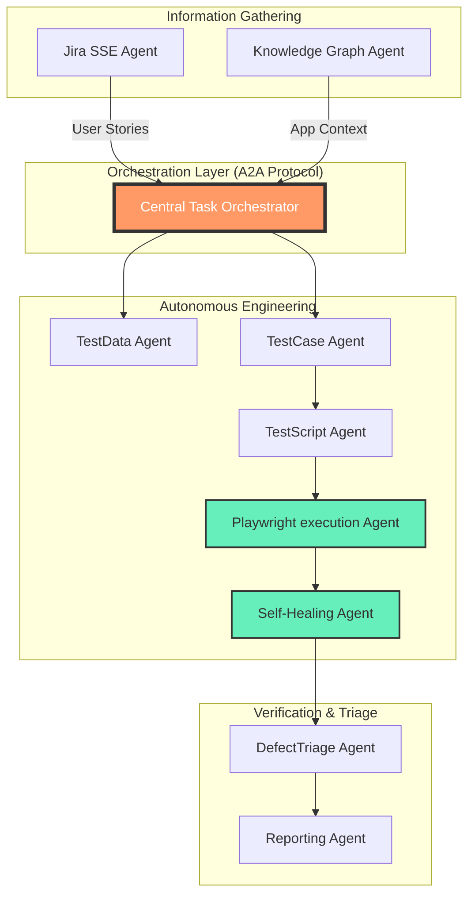

# 
✨ SRISRI JAKKA | Agentic AI Specialist & Cloud Solutions Architect ✨

  
   
  
  

---

### 🚀 The Agentic Vision
As a **Generative AI Engineer** at **Virtusa Corporation**, I architect the autonomous future. My mission is to build self-thinking ecosystems using **Google-ADK**, **A2A Protocol**, and the **Model Context Protocol (MCP)**. I am a **Triple AWS Certified** professional with a **1000/1000 Perfect Score** as an AWS AI Practitioner.

- 🤖 **Agentic Pioneer**: Architected a 9-agent autonomous STLC swarm using **Google-ADK**.
- ☁️ **AWS Certified**: AI Practitioner (**Perfect 1000/1000 Score**), Data Engineer, and Solutions Architect.
- 🥇 **Innovation**: My **TRACE** project was recognized in the **Top 15 GenAI Ideas** at Virtusa.
- 💻 **Open Source**: Maintaining **73+ active repositories** spanning AI, Cloud, and Embedded Systems.

---

### 🤖 The 9-Agent Autonomous STLC Swarm
*Visualizing my flagship multi-agent ecosystem designed for end-to-end testing automation.*

---

### 🛠️ Technical Arsenal

  
  
  
   
  
  
  
  

---

### 🏆 Portfolio Showcases (21+ Major Projects)

#### 🌟 Flagship & Professional
- **TRACE**: **Virtusa Top 15 GenAI Idea**. Multi-model RAG platform (YouTube/Review analytics).
- **MISTA**: Medical Insurance Smart Assistant with 98% accuracy context-aware responses.
- **Q-Code Converter**: Intelligent Oracle-to-Java/Postgres migration suite using LLaMA models.
- **Fuel Stream Engine**: Real-time Kinesis-to-Athena pipeline for fuel station telemetry.
- **Jira MCP Agent**: Fully autonomous Jira lifecycle manager via SSE-based MCP.

#### 🧠 Machine Learning & Computer Vision
- **Face Recognition Attendance**: **27 Stars**; Cloud-integrated system with anti-spoofing logic.
- **Vehicle Plate Detection**: Dual implementation (OpenCV/Python & MATLAB) with live demo.
- **Stock Price Predictor**: Time-series forecasting using Yahoo Finance API and ML.
- **Survival Prediction**: Kaggle-top-percentile Titanic dataset classification.
- **Multicloud Visualizer**: Vision-based recommendation engine for cloud architectures.

#### ☕ Java & Enterprise Logic
- **ATM Interface**: Full object-oriented simulation of banking security and transactions.
- **Online Exam System**: Scalable examination portal with automatic grading and proctoring logs.
- **Online Reservation**: Enterprise-grade booking logic for travel and accommodation.
- **CLI Quiz Master Pro**: Persistent account-based quiz sessions with timed logic.

#### 🌐 Web & Cloud Architecture
- **Bedrock AI SPA**: Serverless query engine hosted on S3/CloudFront.
- **SRK Bricks Portal**: Production-grade business portal with Lambda-backed APIs.
- **Vayuputra Exports**: React/Vite based commercial website.
- **AWS Terraform IaC**: Production-grade VPC and EC2 orchestration templates.

---

### 📊 Github Performance Metrics

  
   
  

---

### 🌐 Socials & Professional Links

---

### 📫 Let's Collaborate!
- ✉️ **Work**: [srisrijakka@virtusa.com](mailto:srisrijakka@virtusa.com)
- 🏢 **Employee ID**: 8145698 (Virtusa Corporation)
- 📍 **Based In**: Hyderabad, India

  Futuristic Portfolio synthesized with precision. Last Updated: March 2026.

