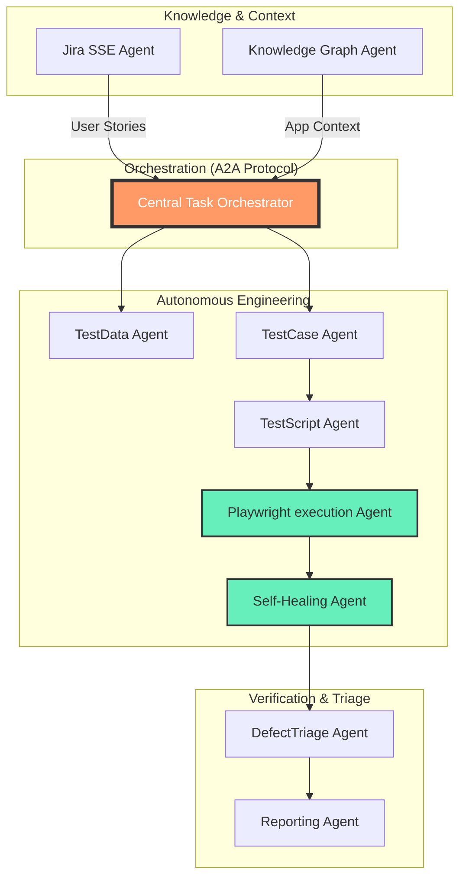

# 🚀 SRISRI JAKKA | Agentic AI Specialist & Cloud Architect

  
  

---

### 🧐 The Agentic Vision
As a **Generative AI Engineer** at **Virtusa Corporation**, I architect the "Self-Thinking" Enterprise. My work revolves around **Multi-Agent Orchestration**, **RAG Optimization**, and **Serverless Cloud Infrastructure**. I am an early adopter of the **Model Context Protocol (MCP)** and the **Agent-to-Agent (A2A)** communication standard.

- 🤖 **Agentic Pioneer**: Architected a 9-agent autonomous STLC swarm using **Google-ADK**.
- ☁️ **AWS Certified**: AI Practitioner (**Perfect 1000/1000 Score**), Data Engineer, and Solutions Architect.
- 🥇 **Innovation**: My **TRACE** project was recognized in the **Top 15 GenAI Ideas** at Virtusa.
- 💻 **Open Source**: Maintaining **73+ active repositories** spanning AI, Cloud, and Embedded Systems.

---

### 🛠️ Technical Arsenal

  
  
  
  
  

---

### 🤖 The 9-Agent Autonomous STLC Swarm
*Visualizing my flagship multi-agent ecosystem designed for end-to-end testing lifecycle automation.*

---

### 🏆 Key Project Showcases (Major Impacts)
| Project | Role | Technical Highlight |
| :--- | :--- | :--- |
| **TRACE** | Architect | Top 15 GenAI Idea; Multi-model RAG with Mistral self-hosting on EC2. |
| **MISTA** | Developer | Real-time Medical Insurance Smart Assistant using Pinecone Vector DB. |
| **Face Recognition** | Lead | **27 Stars**; Real-time attendance with anti-spoofing and cloud logging. |
| **Q-Code** | GenAI Dev | Semantic code migration suite (Oracle to Java/Postgres) using LLaMA. |
| **Fuel Stream** | Data Eng | Real-time Kinesis-to-Athena pipeline processing 1000+ events/sec. |

---

### 📜 Professional Verification
- ☁️ **AWS Certified AI Practitioner** (Score: **1000/1000**)
- 🧩 **AWS Certified Data Engineer – Associate**
- 🏗️ **AWS Certified Solutions Architect – Associate**
- 💎 **OCI 2024 Generative AI Professional**
- 🤖 **Virtusa Certified GenAI Practitioner & Test Engineer**

---

### 📊 Competitive Landscapes

  
  

 

  

---

### 📫 Connect & Collaborate

  Futuristic Profile README synthesized via Antigravity 🤖 Last Updated: March 2026.

