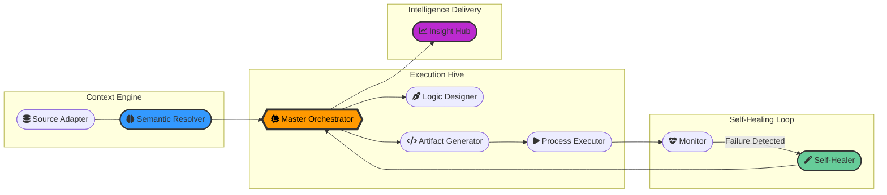

# 
✨ SRISRI JAKKA | Agentic AI Specialist & Cloud Solutions Architect ✨

  
   
  
  

---

### 🚀 The Agentic Vision
As a **Generative AI Engineer**, I architect the autonomous future. My mission is to build self-thinking ecosystems using **Multi-Agent Orchestration (MAO)**, **A2A Communication Protocols**, and **Model Context Protocol (MCP)**. I am a **Triple AWS Certified** professional and an **AWS AI Practitioner**.

- 🤖 **Agentic Pioneer**: Architecting multi-agent autonomous swarms for end-to-end SDLC/STLC workflows.
- 🥇 **Recognition**: **TRACE Project** recognized in the **Top 15 GenAI Ideas** at a premier global technology firm.
- ☁️ **Cloud Expertise**: Specialized in Serverless, RAG Pipelines, and Real-time Data Streaming.
- 💎 **Credentials**: OCI GenAI Professional & Dual-Certified GenAI Practitioner/Test Engineer.

---

### 🤖 The Neural Swarm: Multi-Agent Orchestration
*A high-fidelity visualization of my autonomous agentic ecosystem for complex task automation and self-healing loops.*

---

### 🛠️ Technical Portfolio

  
  
  
   
  
  
  

---

### 🏆 Project Showcases (Selection of 21+ Major Impacts)

#### 🌟 Advanced GenAI & RAG
- **TRACE**: **Award-Winning RAG Platform**. Multi-model analytics for large-scale transcript/review processing.
- **MISTA**: Medical Insurance Smart Assistant utilizing Vector Databases for real-time 98%+ accuracy response.
- **Semantic Code Suite**: AI-powered code transformation (Oracle/Java focus) using cutting-edge LLMs.
- **Jira lifecycle Automation**: Full-stack autonomous agent utilizing MCP for project lifecycle management.

#### 🧠 Machine Learning & Computer Vision
- **Face Recognition Attendance**: **27 Stars**; Cloud-integrated system featuring advanced anti-spoofing algorithms.
- **Autonomous Identification**: Vision-based detection systems implementing OpenCV and MATLAB.
- **Market Predictor**: Time-series forecasting engine leveraging Financial APIs and ML models.

#### 🌐 Enterprise & Cloud
- **Enterprise Booking Engine**: High-scale reservation logic built with Java Enterprise principles.
- **Real-time Telemetry Hub**: AWS Kinesis data streaming pipeline for high-velocity industrial endpoints.
- **Serverless AI Gateway**: Low-latency query interface architected with AWS Bedrock and Lambda.

---

### 📊 Github Performance Metrics

  
   
  

---

### 🌐 Socials & Professional Links

---

### 📫 Let's Connect!
- ✉️ **Contact**: [srisrijakka8@gmail.com](mailto:srisrijakka8@gmail.com)
- 📍 **Based In**: Hyderabad, India

  Portfolio synthesized with privacy-safe technical narratives. Last Updated: March 2026.

