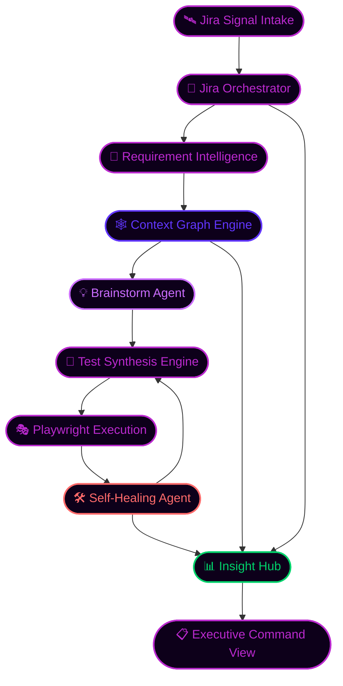
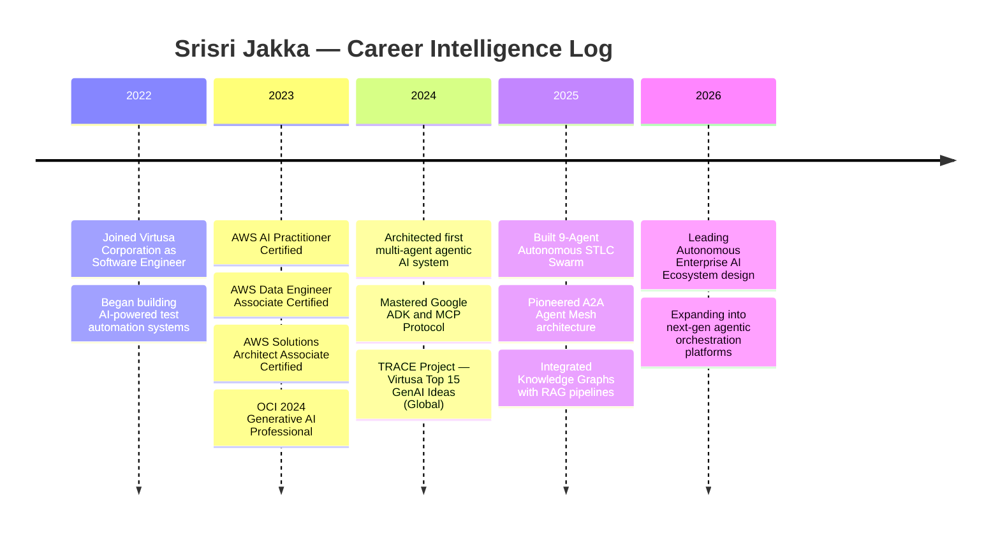
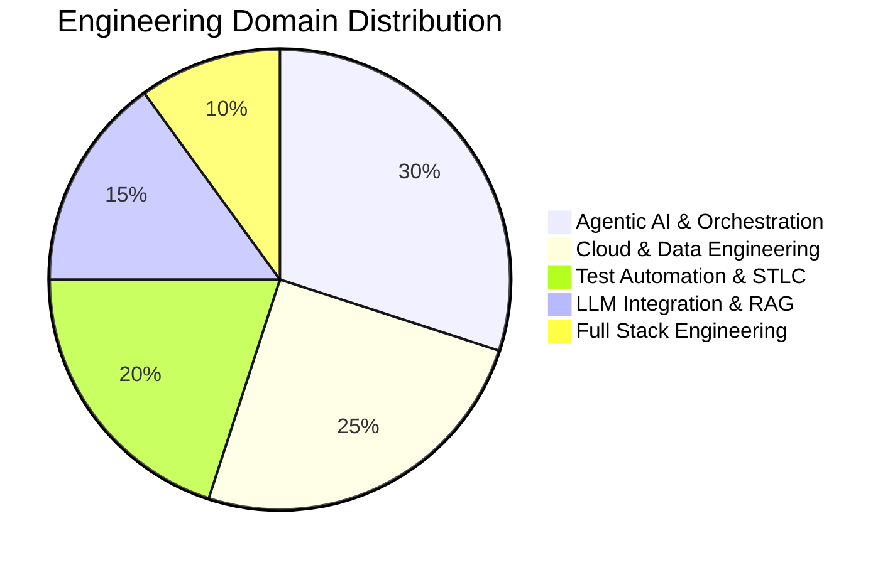

<!-- ████████████████████████████████████████████████████████████████████████████████████ -->
<!--  ██  TRANSMISSION INTERCEPTED  //  SRISRI JAKKA  //  CLEARANCE: OMEGA  ██████████  -->
<!-- ████████████████████████████████████████████████████████████████████████████████████ -->

<div align="center">
  
</div>

<div align="center">
  
</div>

<br/>

<div align="center">
  <a href="mailto:srisri.jakka@gmail.com">
    
  </a>
  &nbsp;
  <a href="https://www.linkedin.com/in/srisri-jakka-8464a9224">
    
  </a>
  &nbsp;
  <a href="https://github.com/Srisrijakka1">
    
  </a>
</div>

<br/>

<div align="center">
  
  
  
  
  
</div>

---

## ⬡ IDENTITY MATRIX

<table align="center" width="100%">
<tr>
<td width="50%" valign="top">

```bash
╔═══════════════════════════════════════════╗
║   ◈  SRISRI JAKKA SYSTEM  ▸  v9.0.0      ║
╠═══════════════════════════════════════════╣
║                                           ║
║  $ whoami                                 ║
║  > Generative AI Engineer                 ║
║    Virtusa Corporation                    ║
║    Hyderabad, India                       ║
║                                           ║
║  $ mission --active                       ║
║  > Architect autonomous enterprise        ║
║    AI ecosystems that observe,            ║
║    decide, execute, heal & report         ║
║                                           ║
║  $ active_system                          ║
║  > 9-Agent STLC Swarm                     ║
║    [████████████████████] ONLINE          ║
║    Google ADK + MCP + A2A + RAG           ║
║                                           ║
║  $ status :: FULLY AUTONOMOUS ◈           ║
╚═══════════════════════════════════════════╝
```

</td>
<td width="50%" valign="top">

```yaml
# NEURAL_CAPABILITY_SCAN.yml

GenAI / Agentic AI:
  level : ████████████████████  100%
  rank  : ◈ ARCHITECT

AWS Cloud Architecture:
  level : ██████████████████░░   90%
  rank  : ◈ EXPERT (3x CERTIFIED)

Test Automation + Playwright:
  level : ██████████████████░░   90%
  rank  : ◈ EXPERT

Data Engineering:
  level : ████████████████░░░░   80%
  rank  : ◈ ADVANCED

Full Stack Engineering:
  level : ███████████████░░░░░   75%
  rank  : ◈ PROFICIENT

MCP / A2A Protocols:
  level : ████████████████████  100%
  rank  : ◈ PIONEER
```

</td>
</tr>
</table>

---

## 🌌 THE CORE AXIOM

<div align="center">
╔═══════════════════════════════════════════════════════════════════════════════╗
║ ║
║ ░░░░░░░░░░░░░░ THE AUTONOMOUS MANIFESTO ░░░░░░░░░░░░░░ ║
║ ║
║ I DON'T BUILD PASSIVE CHATBOTS. ║
║ ║
║ I ARCHITECT INTELLIGENCE ENGINES THAT — ║
║ ║
║ [◈] PERCEIVE CONTEXT IN REAL TIME [◈] FORM AUTONOMOUS DECISIONS ║
║ [◈] SYNTHESIZE EXECUTION PLANS [◈] HEAL FROM ANY FAILURE ║
║ [◈] DELIVER INTELLIGENT INSIGHT [◈] OPERATE WITHOUT HUMAN HAND ║
║ ║
║ ─────────────────────────────────────────────────────────────────── ║
║ ║
║ MISSION STATEMENT : ║
║ Redefine the Software Testing Life Cycle through autonomous AI systems ║
║ that replace manual orchestration with a self-thinking, self-correcting, ║
║ and self-reporting execution fabric. ║
║ ║
╚═══════════════════════════════════════════════════════════════════════════════╝

text

</div>

---

## 🛰️ AUTONOMOUS STLC COMMAND ARCHITECTURE

<div align="center">
  <sub><i>Flagship Platform ▸ Google ADK + MCP + RAG + Knowledge Graphs + Playwright ▸ 9 Agents Live</i></sub>
</div>

<br/>



<br/>

### 🗂️ AGENT DEPLOYMENT FILES ─ Click Each Agent to Expand Full Specs

<details>
<summary><b>🛰️ AGENT_001 — JIRA ORCHESTRATOR</b></summary>
<br/>

| ATTRIBUTE | VALUE |
|:---|:---|
| 🎯 Mission | Requirement extraction & real-time workflow synchronization |
| 📡 Protocol | SSE-based MCP Server |
| ⚡ Trigger | Jira webhook events + scheduled polling |
| 📤 Output | Structured requirement signals → downstream agents |
| 🔗 Connects To | Requirement Intelligence, Insight Hub |
| 🟢 Status | **OPERATIONAL** |

</details>

<details>
<summary><b>🧠 AGENT_002 — REQUIREMENT INTELLIGENCE LAYER</b></summary>
<br/>

| ATTRIBUTE | VALUE |
|:---|:---|
| 🎯 Mission | Extract testing scope, intent, and priority signals from raw data |
| 🤖 Model | Gemini + LangChain pipeline |
| 📥 Input | Raw Jira signals from Orchestrator |
| 📤 Output | Structured test targets + priority matrix |
| 🔗 Connects To | Context Graph Engine |
| 🟢 Status | **OPERATIONAL** |

</details>

<details>
<summary><b>🕸️ AGENT_003 — CONTEXT GRAPH ENGINE</b></summary>
<br/>

| ATTRIBUTE | VALUE |
|:---|:---|
| 🎯 Mission | Build semantic operational memory across all agents |
| 🧮 Technology | Knowledge Graphs + RAG + Pinecone |
| 📥 Input | Requirement intelligence signals |
| 📤 Output | Enriched context payload for all downstream agents |
| 🔗 Connects To | Brainstorm Agent, Insight Hub |
| 🟢 Status | **OPERATIONAL** |

</details>

<details>
<summary><b>💡 AGENT_004 — BRAINSTORM AGENT</b></summary>
<br/>

| ATTRIBUTE | VALUE |
|:---|:---|
| 🎯 Mission | Expand test scenarios, edge cases, boundary conditions |
| 🤖 Model | LLaMA / Mistral with chain-of-thought prompting |
| 📥 Input | Context-enriched requirement payload |
| 📤 Output | Comprehensive test scenario + edge case tree |
| 🔗 Connects To | Test Synthesis Engine |
| 🟢 Status | **OPERATIONAL** |

</details>

<details>
<summary><b>🧪 AGENT_005 — TEST SYNTHESIS ENGINE</b></summary>
<br/>

| ATTRIBUTE | VALUE |
|:---|:---|
| 🎯 Mission | Generate structured, execution-ready test scripts |
| 🛠️ Technology | Gemini + Playwright script generation templates |
| 📥 Input | Test scenario tree from Brainstorm Agent |
| 📤 Output | Production-ready `.spec.ts` Playwright test files |
| 🔗 Connects To | Playwright Execution Layer |
| 🟢 Status | **OPERATIONAL** |

</details>

<details>
<summary><b>🎭 AGENT_006 — PLAYWRIGHT EXECUTION LAYER</b></summary>
<br/>

| ATTRIBUTE | VALUE |
|:---|:---|
| 🎯 Mission | Execute automated multi-browser test workflows |
| 🛠️ Technology | Playwright + Chromium + Firefox + WebKit |
| 📥 Input | Production-ready `.spec.ts` test scripts |
| 📤 Output | Execution logs + failure artifacts + screenshots |
| 🔗 Connects To | Self-Healing Recovery Agent |
| 🟢 Status | **OPERATIONAL** |

</details>

<details>
<summary><b>🛠️ AGENT_007 — SELF-HEALING RECOVERY AGENT  🔴 RECURSIVE LOOP</b></summary>
<br/>

| ATTRIBUTE | VALUE |
|:---|:---|
| 🎯 Mission | Detect, diagnose, and autonomously repair execution failures |
| 🤖 Model | Gemini Vision + error-pattern analysis + selector correction |
| 📥 Input | Execution failure logs + DOM screenshots |
| 📤 Output | Corrected test scripts → loops back to Execution Layer |
| 🔁 Special | **AUTONOMOUS RECURSIVE SELF-CORRECTION LOOP** |
| 🔗 Connects To | Playwright Execution (feedback), Insight Hub |
| 🟢 Status | **OPERATIONAL** |

</details>

<details>
<summary><b>📊 AGENT_008 — INSIGHT HUB</b></summary>
<br/>

| ATTRIBUTE | VALUE |
|:---|:---|
| 🎯 Mission | Synthesize multi-dimensional engineering intelligence |
| 🛠️ Technology | RAG + LangChain + Structured Report Generation |
| 📥 Input | All agent signals, execution logs, and telemetry data |
| 📤 Output | Engineering dashboards + trend analysis + exec summaries |
| 🔗 Connects To | Executive Command View |
| 🟢 Status | **OPERATIONAL** |

</details>

<details>
<summary><b>📋 AGENT_009 — EXECUTIVE COMMAND VIEW</b></summary>
<br/>

| ATTRIBUTE | VALUE |
|:---|:---|
| 🎯 Mission | Surface digestible, decision-ready stakeholder intelligence |
| 🛠️ Technology | Structured markdown + visual chart generation |
| 📥 Input | Insight Hub synthesis packets |
| 📤 Output | Business-facing dashboards and quality status reports |
| 🔗 Connects To | Human stakeholders and executives |
| 🟢 Status | **OPERATIONAL** |

</details>

---

## 📡 MISSION INTELLIGENCE TIMELINE



---

## ⚡ CAPABILITY INTELLIGENCE



---

## ⚙️ FULL RUNTIME ARSENAL

<table align="center" width="100%">
<tr>
<td align="center" width="25%" valign="top">

### 🤖 AGENTIC AI
---
`Google ADK` `MCP`
`A2A` `LangChain`
`RAG` `Pinecone`
`Knowledge Graphs`
`Fine-Tuning`

</td>
<td align="center" width="25%" valign="top">

### ☁️ CLOUD + DATA
---
`AWS` `Kinesis`
`Glue` `Athena`
`S3` `Redshift`
`Lambda`
`CloudWatch`

</td>
<td align="center" width="25%" valign="top">

### 🛠️ ENGINEERING
---
`Python` `JavaScript`
`Java` `TypeScript`
`Playwright` `Docker`
`Jenkins` `Kafka`

</td>
<td align="center" width="25%" valign="top">

### 🧠 AI MODELS
---
`Gemini` `LLaMA`
`Mistral` `Bedrock`
`Claude` `Cohere`
`Ollama` `GPT-4o`

</td>
</tr>
</table>

<br/>

<div align="center">
  
</div>

<br/>

<div align="center">

**◈ ACTIVE PROTOCOLS**

<kbd>MCP</kbd> &nbsp;<kbd>A2A</kbd> &nbsp;<kbd>JSON-RPC</kbd> &nbsp;<kbd>SSE</kbd> &nbsp;<kbd>REST</kbd> &nbsp;<kbd>GraphQL</kbd> &nbsp;<kbd>WebSocket</kbd> &nbsp;<kbd>gRPC</kbd>

<br/><br/>


</div>

---

## 🏆 RECOGNITION VAULT

<div align="center">
╔═══════════════════════════════════════════════════════════════════════════════╗
║ CERTIFICATION REGISTRY — SRISRI JAKKA ║
╠═══════════════════════════════════════════════════════════════════════════════╣
║ ║
║ [✓] AWS AI PRACTITIONER AMAZON WEB SERVICES ║
║ [✓] AWS DATA ENGINEER ASSOCIATE AMAZON WEB SERVICES ║
║ [✓] AWS SOLUTIONS ARCHITECT ASSOCIATE AMAZON WEB SERVICES ║
║ [✓] OCI 2024 GENERATIVE AI PROFESSIONAL ORACLE CLOUD ║
║ [✓] VIRTUSA TRACE PROJECT — TOP 15 GENAI IDEAS VIRTUSA GLOBAL 🏆 ║
║ [✓] CODECHEF 3-STAR · MAX RATING: 1649 COMPETITIVE CODING ║
║ [✓] HACKERRANK 4-STAR PROBLEM SOLVER COMPETITIVE CODING ║
║ ║
╚═══════════════════════════════════════════════════════════════════════════════╝

text

</div>

---

## 💎 ARTIFACT VAULT

<div align="center">
  <a href="https://github.com/Srisrijakka1/BedRock-Model-ChatGpt">
    
  </a>
  <a href="https://github.com/Srisrijakka1/Real-Time-Face-Recognition-Based-Attendance-Monitoring-System">
    
  </a>
</div>

<div align="center">
  <a href="https://github.com/Srisrijakka1/UART-Design-simulation-using-verilog">
    
  </a>
  <a href="https://github.com/Srisrijakka1/VEHICLE_NUMBER_PLATE_DETECTION_USING_OPENCV_BY_DIGITAL_IMAGE_PROCESSING">
    
  </a>
</div>

---

## 📊 LIVE TELEMETRY COMMAND PANEL

<div align="center">
  
  
</div>

<div align="center">
  
</div>

<div align="center">
  
</div>

<div align="center">
  
  
  
  
</div>

<div align="center">
  
</div>

---

## 🐍 SWARM SIGNAL GRID

<div align="center">
  <picture>
    <source media="(prefers-color-scheme: dark)" srcset="https://raw.githubusercontent.com/Srisrijakka1/Srisrijakka1/output/github-contribution-grid-snake-dark.svg"/>
    <source media="(prefers-color-scheme: light)" srcset="https://raw.githubusercontent.com/Srisrijakka1/Srisrijakka1/output/github-contribution-grid-snake.svg"/>
    
  </picture>
</div>

---

## 🌐 NEURAL ACTIVITY STREAM

<div align="center">
  
</div>

---

## 🔓 OPEN CHANNELS

<table align="center" width="100%">
<tr>
<td width="50%" valign="top">

```bash
$ collaboration --query

STATUS      : ACTIVE
MODE        : OPEN
RESPONSE    : < 24 HOURS
TIMEZONE    : IST (UTC+5:30)

ACCEPTING_MISSIONS = [
  "Agentic AI system architecture",
  "Multi-agent workflow design",
  "RAG + knowledge graph builds",
  "Self-healing automation platforms",
  "Cloud-native GenAI products",
  "AI-powered enterprise testing"
]

$ ./send_signal --target srisri.jakka@gmail.com
```

</td>
<td width="50%" valign="top">

```yaml
# CONTACT_REGISTRY.yml

identity:
  name:   Srisri Jakka
  handle: Srisrijakka1

channels:
  email:    srisri.jakka@gmail.com
  linkedin: srisri-jakka-8464a9224
  github:   Srisrijakka1

employment:
  company:  Virtusa Corporation
  role:     Generative AI Engineer
  status:   Active

collaboration:
  open:     true
  response: < 24 hours
  priority: Enterprise AI Builds
```

</td>
</tr>
</table>

<div align="center">
  <a href="mailto:srisri.jakka@gmail.com">
    
  </a>
  &nbsp;
  <a href="https://www.linkedin.com/in/srisri-jakka-8464a9224">
    
  </a>
</div>

---

<div align="center">
  
</div>

<br/>

<div align="center">
  
</div>
